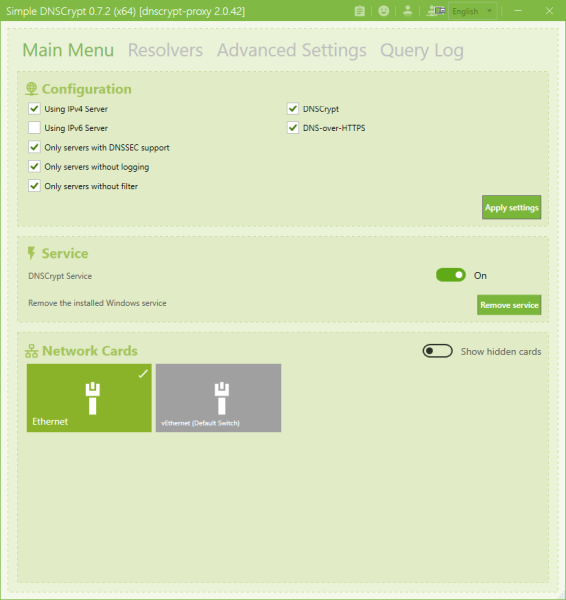
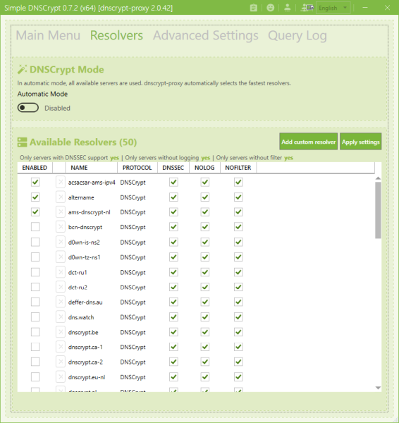
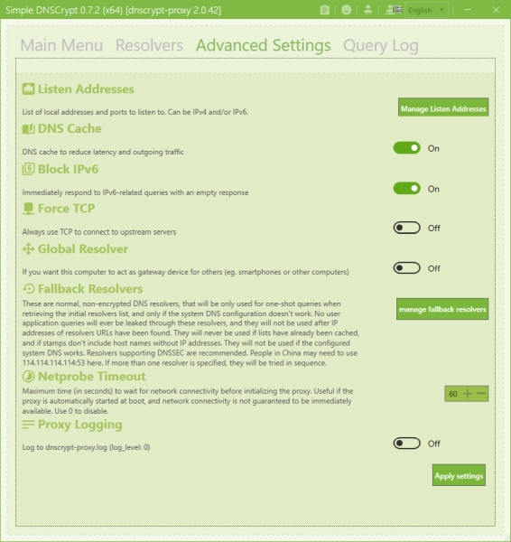
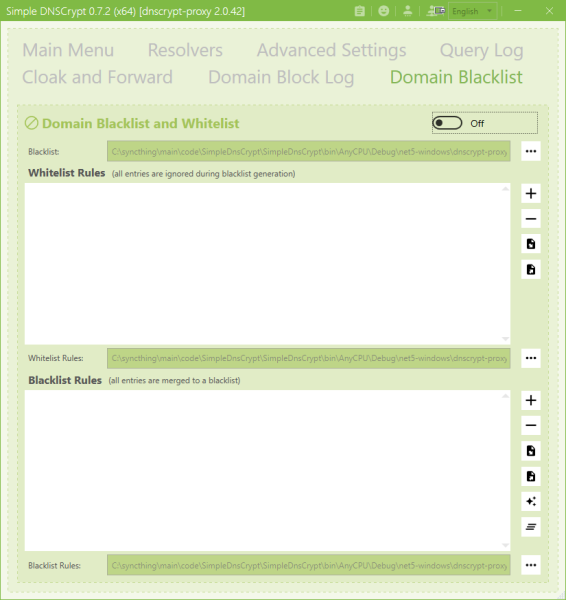
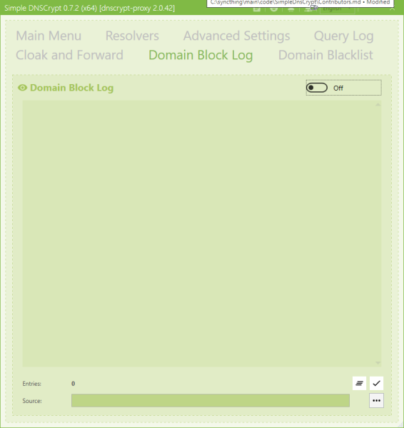
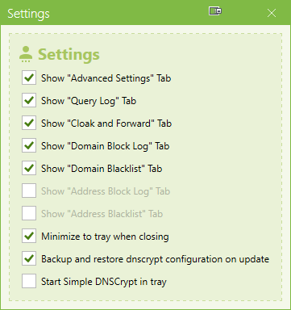

 
 
 
 

# 

# Fork
This was forked from [here](https://github.com/bitbeans/SimpleDnsCrypt) due to inactivity. I was able to fix a few things that were bugging me and see no reason not to share.

Note that this repository has **no** connection to OpenCollective or any other form of funding.

# Simple DNSCrypt
Simple DNSCrypt is a simple management tool to configure [dnscrypt-proxy](https://github.com/jedisct1/dnscrypt-proxy) on windows based systems. 

## Status

Uses dnscrypt-proxy: **2.0.42**

## Getting Started

### Prerequisites

Windows 10 LTSC 1809 is tested(-ish) to work, other users are welcome to test and report other Windows versions.

### Installing

To install Simple DNSCrypt use the [MSI package](https://github.com/instantsc/SimpleDnsCrypt/releases/download/0.7.2-beta1/SimpleDNSCrypt.msi).

### Deinstallation

To uninstall Simple DNSCrypt and dnscrypt-proxy, just go to the Windows Control Panel (Programs and Features) and search for Simple DNSCrypt.

### Updates

For now, the only update option is to download and install the newest version manually. Note that in .NET the setting storage is tied to the binary location, and so you'll either have to migrate manually or to install update to the same location as before.

## Screenshots

## Built With

* [Visual Studio 2019](https://www.visualstudio.com/downloads/)
* [.NET 5](https://dotnet.microsoft.com/download/dotnet)
* [WiX](https://wixtoolset.org/)

## Authors

* **Christian Hermann** - [bitbeans](https://github.com/bitbeans)
* [**instant.sc**](https://github.com/instantsc)

See also the list of [Contributors.md](Contributors.md) who participated in this project. 
If you are a translator, feel free to update this file.

## License

This project is licensed under the MIT License - see the [LICENSE.md](LICENSE.md) file for details

## Used Software and Libraries

- [Caliburn.Micro](https://github.com/Caliburn-Micro/Caliburn.Micro)
- [DnsCrypt.Toolbox](https://github.com/bitbeans/DnsCrypt.Toolbox)
- [gong-wpf-dragdrop](https://github.com/punker76/gong-wpf-dragdrop)
- [MahApps.Metro](https://github.com/MahApps/MahApps.Metro)
- [MahApps.Metro.SimpleChildWindow](https://github.com/punker76/MahApps.Metro.SimpleChildWindow)
- [Nett](https://github.com/paiden/Nett)
- [Newtonsoft.Json](https://github.com/JamesNK/Newtonsoft.Json)
- [NLog](https://github.com/nlog/NLog)
- [notifyicon-wpf](https://bitbucket.org/hardcodet/notifyicon-wpf/src)
- [WPFLocalizationExtension](https://github.com/SeriousM/WPFLocalizationExtension)
- [YamlDotNet](https://github.com/aaubry/YamlDotNet)

## Thanks to

* Frank Denis for the development of [dnscrypt-proxy](https://github.com/jedisct1/dnscrypt-proxy)
* all users, translators and contributors

### Contributors

This project exists thanks to all the people who contribute. [[Contributors](Contributors.md)].